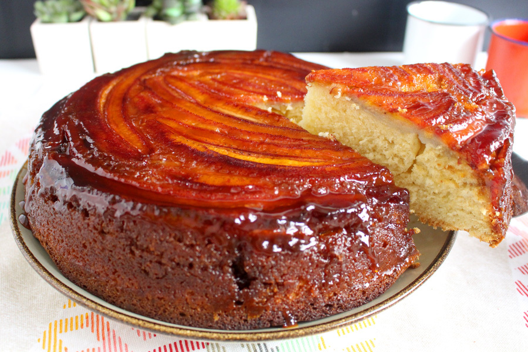

# Receita de Bolo de banana
primeiro website criado , do tipo lading page para treino no desenvolvimento de sites.
O site foi desenvolvido utilizando boas praticas , como por exemplo tegs semanticas e responsividade. 
## tecnologia 
*HTML  
*CSS  
*Media Queries
## Autor
contato:[Luis Felipe GitHub](https://github.com/Lu-queir0z)
##